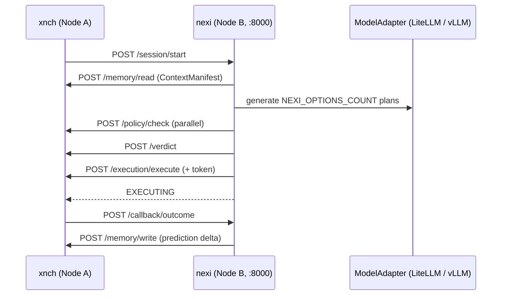

# Nexi

Decision engine for the xNCH two-node stack. Nexi turns a raw request into a policy-checked, scored, verdict-backed execution — then learns from the outcome.

It is a FastAPI service (`nexi/main.py`) on port 8000, deployed on Node B under bare venv + systemd. It calls the `xnch` control plane over HTTP and generates options through LiteLLM or a local vLLM server.

**Contents**

- [Pipeline overview](#pipeline-overview)
- [HTTP endpoints](#http-endpoints)
- [Configuration](#configuration)
- [Adapters and integrations](#adapters-and-integrations)
- [Character and persona](#character-and-persona)
- [Autonomous loops](#autonomous-loops)
- [Repository layout](#repository-layout)
- [Tests](#tests)
- [Deployment notes](#deployment-notes)
- [Sources of truth](#sources-of-truth)

## Pipeline overview

Every `POST /session/start` runs one decision pass in `pipeline/run.py`. The ten steps:

1. **Interpret intent** — rule-based classifier first, then a Redis recall cache, then LLM classification (`NEXI_INTENT_CLASSIFIER_MODEL`).
2. **Load context** — fetches a ContextManifest from xnch `POST /memory/read`. Failure stops the pass.
3. **Generate options** — produces `NEXI_OPTIONS_COUNT` candidate plans (default 5) via structured LLM output.
4. **Filter by policy** — dry-runs every option against xnch `POST /policy/check`, in parallel.
5. **Evaluate** — scores options on outcome, risk, and context fit using per-intent weights (`weights/`); simulates and rescores the top candidates that need forward projection.
6. **Select** — picks the winner and builds the Decision Record. Low confidence escalates instead of executing.
7. **Compile the action spec** — validates the chosen plan into an executable DAG before anything ships.
8. **Submit the verdict** — xnch `POST /verdict` is authoritative. Stale state versions trigger one retry with a fresh context, then HTTP 409.
9. **Dispatch execution** — sends the action spec and execution token to the runner through xnch `POST /execution/execute`.
10. **Respond `EXECUTING`** — returns the decision and execution references while work continues in the background.

After execution, xnch calls `POST /callback/outcome`. Nexi computes `prediction_delta` against its predicted score and writes an episode prediction update back to xnch memory. With reflection enabled, a fire-and-forget Reflector also distills the outcome into a stored lesson.



## HTTP endpoints

| Method | Path | Purpose |
|--------|------|---------|
| POST | `/session/start` | Run one decision pass. Returns `EXECUTING`, or `CLARIFICATION_REQUIRED`, `ESCALATED`, or `ERROR`. |
| POST | `/callback/outcome` | Receive the execution outcome from xnch, compute `prediction_delta`, and write the update back to xnch memory. |
| GET | `/health` | Liveness probe. Returns `{"status": "ok", "version": "0.1.0"}`. |
| GET | `/nexi/capabilities` | Live merged capability snapshot: hosts, tools, probe status. |
| POST | `/nexi/refresh` | Force a full refresh: topology scan, tool inventory, probes, overlay write. |

These five routes are the entire HTTP surface. Everything else happens over outbound calls to xnch.

## Configuration

Settings come from environment variables with the `NEXI_` prefix (pydantic-settings, `config.py`). Defaults shown; the exhaustive reference lives in the parent repository at `../docs/reference/env-vars.md` (path only — separate repositories).

**Control plane**

- `NEXI_XNCH_BASE_URL` — xnch base URL (default `http://localhost:8001`)
- `NEXI_XNCH_PUBLIC_KEY_PATH` — RSA public key for execution-token material (default `~/.xnch/keys/public.pem`)

**Model adapter**

- `NEXI_VLLM_PRIMARY_URL` — primary inference endpoint (default `http://192.168.50.2:8082/v1`)
- `NEXI_VLLM_PRIMARY_TIMEOUT_S` — 30.0
- `NEXI_VLLM_SECONDARY_URL` — optional fallback endpoint (default empty)
- `NEXI_VLLM_SECONDARY_TIMEOUT_S` — 45.0
- `NEXI_MODEL_ID` — served model (default `ornith-1.0-35b`)
- `NEXI_OPTIONS_COUNT` — plans per pass (default 5)

**LiteLLM**

- `NEXI_LITELLM_PROXY_URL` — proxy base (default `http://localhost:4000/v1`)
- `NEXI_LITELLM_PROXY_TIMEOUT_S` — 60.0
- `NEXI_LITELLM_API_KEY` — bearer token (default empty)
- `NEXI_INTENT_CLASSIFIER_MODEL` — default `ornith`
- `NEXI_REFLECTION_MODEL` — default `ornith`
- `NEXI_REFLECTION_ENABLED` — default `true`

**Sessions**

- `NEXI_SESSION_TTL_S` — 120
- `NEXI_CLARIFICATION_TTL_S` — 120
- `NEXI_EXECUTION_TOKEN_TTL_MS` — 30000

**Services and storage**

- `NEXI_REDIS_URL` — KV cache shared with xnch (default `unix:///tmp/xnch-redis.sock`; cross-node deployments override to `redis://<node-a-ip>:6379/0`)
- `NEXI_EXECUTION_RUNNER_URL` — execution runner base (default `http://192.168.50.1:8001/execution`)
- `NEXI_VLLM_HEALTH_URL` — used by the proactivity engine (default `http://192.168.50.2:8082/health`)
- `NEXI_AUDIT_EVENTS_PATH` — JSONL audit sink (default `~/.xnch/audit/events.jsonl`)

**Capability auto-refresh**

- `NEXI_CAPABILITIES_GENERATED_PATH` — generated overlay (default `~/.xnch/nexi-capabilities.generated.yaml`)
- `NEXI_MCP_SERVERS_PATH` — MCP server inventory (default `~/.xnch/mcp-servers.yaml`)
- `NEXI_INFRA_MANIFESTS_PATH` — manifests root (default `infra/no-k3s` at the repository root — the parent monorepo's tree when consumed as a submodule)
- `NEXI_EXEC_POLICY_PATH` / `NEXI_FS_POLICY_PATH` — default `~/.xnch/exec-policy.yaml` / `~/.xnch/fs-policy.yaml`
- `NEXI_CAPABILITY_REFRESH_INTERVAL_S` — full rebuild (default 300)
- `NEXI_PROBE_INTERVAL_S` — live probe cadence (default 60)
- `NEXI_PROBE_TIMEOUT_S` — 2.0
- `NEXI_XNCH_TOOLS_ENDPOINT` — tool inventory source (default `/nexi/tools`)
- `NEXI_CAPABILITY_AUTO_REFRESH` — default `true`

**Goal driver** — see [Autonomous loops](#autonomous-loops)

**Workflow executor** — see [Autonomous loops](#autonomous-loops)

## Adapters and integrations

Two adapter classes isolate all external I/O.

**`XnchClient`** (`adapters/xnch_client.py`) — async HTTP client for the control plane. Outbound routes:

- `POST /memory/read` — context manifest
- `POST /policy/check` — one call per option, issued in parallel
- `POST /verdict` — authoritative decision record
- `POST /memory/write` — episode prediction updates
- `POST /goals/claim` and `POST /goals/{goal_id}/update` — goal driver
- `POST /workflows/steps/claim` — workflow executor

The execution token attached to the verdict is forwarded unchanged to the execution runner.

**`ModelAdapter`** (`adapters/model_adapter.py`) — option generation with a fallback chain:

1. LiteLLM proxy (`NEXI_LITELLM_PROXY_URL`)
2. vLLM primary, OpenAI-compatible endpoint serving `ornith-1.0-35b`
3. Optional vLLM secondary (`NEXI_VLLM_SECONDARY_URL`, empty by default)

Intent classification and reflection reuse the same LiteLLM route with their own model names.

## Character and persona

The `character/` package gives nexi a stable identity.

- `persona.yaml` — identity, style rules, and hard "never do" boundaries injected into system prompts.
- `capabilities.yaml` — hosts, tools, and tool routing. `capability_builder.py` merges this with a live view: systemd units parsed from the `NEXI_INFRA_MANIFESTS_PATH` manifests, MCP tools from `NEXI_MCP_SERVERS_PATH`, and health probes every `NEXI_PROBE_INTERVAL_S`. The merged result is written to `NEXI_CAPABILITIES_GENERATED_PATH` on every full refresh cycle, or on demand via `POST /nexi/refresh`.
- `identity_facts.yaml` — canonical facts seeded into xnch pgvector memory by `cold_start_seeder.py`.
- `prompt_loader.py` — assembles persona, capabilities, and identity facts into prompts.

## Autonomous loops

Both loops start inside the FastAPI lifespan and stay off unless enabled.

### Goal driver (`goal/driver.py`)

Claims goals from the xnch GoalStore and drives them step by step.

- Enable: `NEXI_GOAL_DRIVER_ENABLED=true`
- Poll interval: `NEXI_GOAL_POLL_INTERVAL_S` (default 5)
- Claims via `POST /goals/claim` with lease owner `nexi-goal-driver`
- Safety limits: `NEXI_GOAL_DEFAULT_MAX_STEPS=10`, `NEXI_GOAL_DEFAULT_FAILURE_THRESHOLD=3`, `NEXI_GOAL_MAX_CONSECUTIVE_STEP_ERRORS=3`

A goal that exceeds its failure threshold or racks up too many consecutive step errors is reported blocked to xnch instead of looping forever.

### Workflow executor (`workflow/executor.py`)

Claims APPROVED workflow steps from xnch and runs each through one full pipeline pass.

- Enable: `NEXI_WORKFLOW_EXECUTOR_ENABLED=true` **and** matching `XNCH_WORKFLOW_EXECUTOR_ENABLED=true` on the control plane. Both sides must agree.
- Poll interval: `NEXI_WORKFLOW_POLL_INTERVAL_S` (default 5)
- Claim: `POST /workflows/steps/claim` with body `{"lease_owner": "nexi-wf-executor", "ttl_s": ...}`
- Loop: strictly serialized claim → execute → post outcome `SUCCESS` or `FAILURE`. Transient errors log a warning and never kill the loop.
- Leases are released implicitly by TTL expiry (default 120 s) — there is no explicit release call. Size the TTL above your worst-case step runtime.
- On `FAILURE`, xnch retries the step with backoff up to its max retries before marking it `FAILED`.

Note: `PARTIAL` is a valid outcome status in the shared outcome model (`models/outcomes.py`) and is accepted by `POST /callback/outcome`, but the executor itself posts only `SUCCESS` or `FAILURE`.

## Repository layout

```
nexi/
├── main.py                # FastAPI app, endpoints, lifespan loops
├── config.py              # pydantic-settings, NEXI_ prefix
├── adapters/              # XnchClient, ModelAdapter
├── character/             # persona/capabilities/identity YAMLs, seeder, prompt loader
├── goal/                  # planner.py, driver.py — autonomous goals
├── workflow/              # executor.py — APPROVED-step runner
├── proactivity/           # engine.py — pattern/consolidation/inference alerts
├── pipeline/              # one decision pass, intent → dispatch, reflector
├── models/                # Pydantic: intent, session, dag/options, outcomes, goal
├── eval/                  # eval harness, grader, cases.yaml, CLI
├── infra/                 # discovery.py — manifest parsing and service probes
├── policies/default.yaml  # local policy data
├── weights/               # per-intent-class scoring weight configs
├── utils/                 # audit event emitter, context signature
└── tests/                 # async pytest suite
```

## Tests

Tests live beside the code in `tests/` and run as plain pytest (async mode is automatic via `asyncio_mode = "auto"`):

```bash
pytest nexi/tests                       # whole suite
pytest nexi/tests/test_evaluator.py     # single file
pytest -k "test_workflow_executor"      # by keyword
```

For coverage across both packages, use the parent monorepo command: `pytest --cov=nexi --cov=xnch`.

## Deployment notes

Production target is Node B (an RTX 3090 host) under bare venv + systemd. Node B has no Docker; everything runs as native services. Unit templates live in the parent repository under `infra/no-k3s/node-b/systemd/` — the essentials:

```ini
EnvironmentFile=/home/<user>/.xnch/nexi.env
ExecStart=<venv>/bin/uvicorn nexi.main:app --port 8000
```

Operational gotchas, in order of how often they bite:

1. **PYTHONPATH needs both checkouts.** Nexi imports `xnch.observability.langfuse_client` and `xnch.routing.classifier`. `PYTHONPATH` must contain the nexi repository root *and* the sibling xnch checkout root, or the service dies on import.
2. **GPU must be idle before vLLM starts.** The model occupies roughly 22 GiB of 24 GiB VRAM (gptq_marlin kernels, FLASH_ATTN set in the vLLM unit). Start `vllm-ornith.service` only after training jobs have released the GPU.
3. **Version mismatch returns 409.** `/session/start` carries `system_state_version` and `policy_version`. If they lag xnch's current `/system/state`, nexi retries once with a fresh context manifest, then fails with HTTP 409 `STALE_SESSION`.
4. **Cross-node Redis.** The default `NEXI_REDIS_URL` targets a Unix socket, which assumes nexi shares a host with it. Split deployments must set `redis://<node-a-ip>:6379/0`.

## Sources of truth

Code in this repository:

- `main.py`, `config.py` — HTTP surface and every setting default
- `pipeline/run.py` — authoritative step order and 409 handling
- `adapters/xnch_client.py` — exact outbound xnch routes
- `workflow/executor.py`, `goal/driver.py` — loop semantics and lease owners

Parent documentation (paths relative to this README; separate repositories, referenced inline rather than linked):

- `../docs/reference/env-vars.md` — exhaustive variable reference
- `../docs/architecture/topology.md` — node layout and service inventory
- `../infra/README.md` and `../infra/no-k3s/node-b/systemd/` — units and startup scripts
- `../docs/runbooks/restart-node-b.md` — restart procedure
